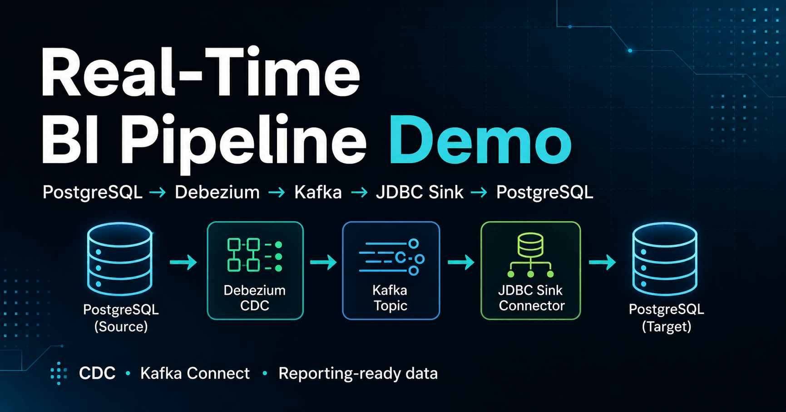

# Real-Time BI Pipeline Demo: PostgreSQL → Debezium → Kafka → JDBC Sink → PostgreSQL

A self-contained demo project showing how operational data can be streamed into a BI-ready target database using **PostgreSQL**, **Debezium CDC**, **Kafka in KRaft mode**, **Kafka Connect**, and a **JDBC sink**.

This repository uses dummy data only. It does not contain proprietary code, production credentials, or company data.

## Business use case

This demo shows how operational database changes can be streamed into a reporting-ready database for BI and analytics use cases.

In a business setting, this pattern can help reduce reporting latency, improve data availability for dashboards, and support more reliable KPI reporting for management, product, sales, customer care, and operations teams.


## What this demonstrates

- Capturing database changes from PostgreSQL with Debezium CDC
- Streaming change events through Kafka without ZooKeeper, using KRaft mode
- Loading CDC events into a target PostgreSQL database with Kafka Connect JDBC sink
- Creating a BI-ready replicated table for reporting use cases
- Testing inserts, updates, and schema evolution locally with Docker Compose

## Architecture

```text
PostgreSQL source DB
        │
        │ Debezium PostgreSQL connector
        ▼
Kafka topic: bi_demo.public.users
        │
        │ Kafka Connect JDBC sink
        ▼
PostgreSQL target DB: users_copy
```

This demo streams changes from an operational PostgreSQL table into a reporting-ready PostgreSQL table. 
The target table can be used by BI tools or downstream analytics workflows for near real-time reporting.

## Tech stack

- PostgreSQL 16.2
- Apache Kafka / Kafka Connect via Confluent Platform 7.6.1
- Debezium PostgreSQL connector 2.5.4
- Kafka Connect JDBC sink 10.7.6
- Docker Compose

## Repository structure

```text
.
├── connectors/              # Kafka Connect source and sink connector configs
├── docs/                    # Architecture and portfolio notes
├── scripts/                 # Demo startup/reset/connector registration scripts
├── sql/                     # Source database setup and CDC test queries
├── docker-compose.yml       # Local demo stack
└── README.md
```

## Prerequisites

- Docker
- Docker Compose
- curl
- Python 3, used by the connector registration script to parse JSON
- psql client, optional but useful for testing

## Quick start

```bash
git clone <your-repo-url>
cd bi-kafka-cdc-demo
./scripts/start-demo.sh
```

The first startup can take a few minutes because Kafka Connect installs the Debezium and JDBC connector plugins.

## Check connector status

```bash
curl -s http://localhost:8083/connectors/postgres-users-source/status | python3 -m json.tool
curl -s http://localhost:8083/connectors/postgres-users-sink/status | python3 -m json.tool
```

Both connectors should show `RUNNING`.

## Test the source database

Open the source database:

```bash
psql -h localhost -p 5434 -U sourceuser -d sourcedb
# password: sourcepass
```

Check sample rows:

```sql
SELECT * FROM users;
```

## Check the replicated target table

Open the target database:

```bash
psql -h localhost -p 5436 -U targetuser -d targetdb
# password: targetpass
```

Check the replicated table:

```sql
SELECT * FROM users_copy ORDER BY user_id;
```

## Test CDC changes

Run these commands in the source database:

```sql
INSERT INTO users (username, email, account_status)
VALUES ('user5', 'user5@example.com', 'active');

UPDATE users
SET email = 'user1.updated@example.com'
WHERE username = 'user1';

ALTER TABLE users ADD COLUMN user_segment TEXT NOT NULL DEFAULT 'standard';

UPDATE users
SET user_segment = 'premium'
WHERE username = 'user2';
```

Then check the target database again:

```sql
SELECT * FROM users_copy ORDER BY user_id;
```

## Reset the demo

```bash
./scripts/reset-demo.sh
```

## Notes and limitations

- The credentials in this repository are demo-only local credentials.
- This is a local proof of concept, not a production deployment template.
- Deletes are not enabled in the JDBC sink config to keep the demo easy to inspect.
- For production, add proper secret management, monitoring, access control, schema governance, and connector retry/dead-letter-queue handling.
